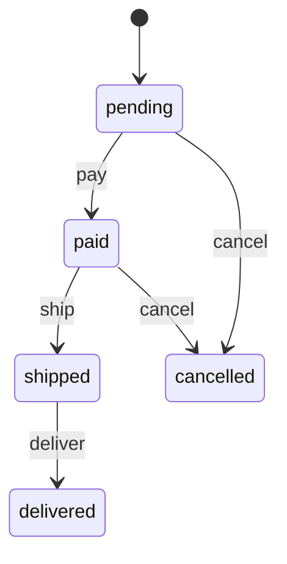

# Laravel State Machine

[](https://packagist.org/packages/webrek/laravel-state-machine)
[](https://packagist.org/packages/webrek/laravel-state-machine)
[](https://github.com/webrek/laravel-state-machine/actions/workflows/tests.yml)
[](https://php.net)
[](LICENSE)

State machines declarativas para modelos Eloquent. Define los estados en los que
puede estar un modelo y las transiciones entre ellos, y deja que el paquete
garantice que solo ocurran transiciones válidas — con guards, eventos y un
registro de auditoría opcional.

## Inicio rápido

```bash
composer require webrek/laravel-state-machine
```

Define una máquina:

```php
use Webrek\StateMachine\StateMachine;
use Webrek\StateMachine\Transition;

class OrderStatus extends StateMachine
{
    public function states(): array
    {
        return ['pending', 'paid', 'shipped', 'delivered', 'cancelled'];
    }

    public function transitions(): array
    {
        return [
            'pay'     => Transition::from('pending')->to('paid'),
            'ship'    => Transition::from('paid')->to('shipped')
                            ->guard(fn ($order) => filled($order->address)),
            'deliver' => Transition::from('shipped')->to('delivered'),
            'cancel'  => Transition::from(['pending', 'paid'])->to('cancelled'),
        ];
    }

    public function initialState(): string
    {
        return 'pending';
    }
}
```

Enlázala a un atributo del modelo:

```php
use Illuminate\Database\Eloquent\Model;
use Webrek\StateMachine\Concerns\HasStateMachines;

class Order extends Model
{
    use HasStateMachines;

    public function stateMachines(): array
    {
        return ['status' => OrderStatus::class];
    }
}
```

Úsala:

```php
$order = Order::create();          // status inicializado en "pending"

$order->stateMachine()->can('pay');        // true
$order->stateMachine()->allowed();         // ['pay', 'cancel']
$order->stateMachine()->apply('pay');      // status ahora es "paid", persistido

$order->stateMachine()->apply('deliver');  // lanza TransitionNotAllowedException
```

## Por qué una state machine en lugar de sentencias `if`

El estado de un pedido, una suscripción, un ticket de soporte o una solicitud de
KYC rara vez es una cadena de texto libre: es un conjunto de estados con nombre y
reglas estrictas sobre cuál puede seguir a cuál. Codificar esas reglas como
verificaciones `if ($order->status === 'paid')` dispersas significa que las
reglas viven en una docena de lugares y nada impide un salto inválido como
`pending → delivered`.

Una state machine pone las reglas en una sola declaración y las hace cumplir:

- **Las transiciones inválidas no pueden ocurrir.** Aplicar una transición desde
  el estado equivocado lanza una excepción en lugar de corromper tus datos en
  silencio.
- **Los guards condicionan las transiciones a reglas de negocio.** "No puedes
  enviar sin una dirección" se convierte en un guard, no en un comentario de code
  review.
- **Cada cambio emite un evento.** Engancha efectos secundarios (enviar el
  recibo, notificar al almacén) a `StateTransitioned` en lugar de buscar cada
  setter.
- **Obtienes un registro de auditoría gratis.** El historial opcional registra
  quién movió qué, desde dónde, hacia dónde y cuándo.

## La API del handler

`$model->stateMachine($attribute)` devuelve un handler. Con una sola máquina el
atributo es opcional.

```php
$sm = $order->stateMachine('status');

$sm->state();                  // 'paid'
$sm->is('paid');               // true
$sm->can('ship');              // bool — permitido desde aquí Y el guard pasa
$sm->allowed();                // ['ship', ... ] nombres de transiciones disponibles ahora
$sm->canTransitionTo('shipped'); // bool
$sm->apply('ship', ['carrier' => 'DHL']); // devuelve el modelo
$sm->history();                // Collection de transiciones registradas
```

El arreglo de contexto que se pasa a `apply()` llega a los guards y a los eventos
despachados, y se almacena junto con la fila del historial.

## Guards

Un guard es un closure que recibe el modelo y el arreglo de contexto. La
transición solo se permite cuando devuelve `true`.

```php
'refund' => Transition::from('paid')->to('refunded')
    ->guard(fn ($order, array $context) => $context['approved_by'] ?? false),
```

`can()` devuelve `false` cuando un guard la bloquea; `apply()` lanza
`GuardFailedException`.

## Efectos de transición (atómicos)

Adjunta un efecto secundario a una transición con `->using()`. Se ejecuta dentro
de la **misma transacción de base de datos** que el cambio de estado y el
registro del historial, así que todo es todo-o-nada: si el efecto lanza una
excepción, el estado nunca se mueve.

```php
'refund' => Transition::from('paid')->to('refunded')
    ->using(function ($order, array $context) {
        $order->payment->refund();          // si esto lanza una excepción...
        $order->refund_reference = $context['reference'];
        $order->save();
    }),
```

Si `payment->refund()` lanza una excepción, la transición se revierte — el pedido
permanece en `paid`, no se escribe ninguna fila de historial y el modelo en
memoria se restaura. Sin transiciones aplicadas a medias.

## Diagrama

Renderiza cualquier máquina como un diagrama de estados de [Mermaid](https://mermaid.js.org):

```php
$order->stateMachine()->toMermaid();
// o, para una clase de definición:
(new OrderStatus)->toMermaid();
```

```bash
php artisan state-machine:diagram "App\\States\\OrderStatus"
```



Pega la salida en un bloque ```mermaid de Markdown (GitHub lo renderiza) o en
cualquier editor en vivo de Mermaid.

## Eventos

Dos eventos se disparan alrededor de cada transición:

- `Webrek\StateMachine\Events\StateTransitioning` — antes de guardar el nuevo estado.
- `Webrek\StateMachine\Events\StateTransitioned` — después de guardarlo.

Ambos llevan el modelo, el atributo, `from`, `to`, el nombre de la transición y el contexto.

```php
Event::listen(StateTransitioned::class, function ($event) {
    if ($event->transition === 'ship') {
        Notification::send($event->model->customer, new OrderShipped($event->model));
    }
});
```

## Historial de transiciones

El historial es opcional. Publica y ejecuta la migración, luego actívalo:

```bash
php artisan vendor:publish --tag=state-machine-migrations
php artisan migrate
```

```env
STATE_MACHINE_HISTORY=true
```

Cada transición aplicada queda entonces registrada, y `->history()` devuelve el
rastro, del más antiguo al más reciente:

```php
$order->stateMachine()->history()->each(function ($row) {
    echo "{$row->from_state} → {$row->to_state} via {$row->transition}";
});
```

Cada fila almacena el sujeto (morph), el campo, `from_state`, `to_state`, el
nombre de la transición, el contexto JSON y las marcas de tiempo.

## Múltiples máquinas por modelo

Un modelo puede manejar varios atributos a la vez:

```php
public function stateMachines(): array
{
    return [
        'status'         => OrderStatus::class,
        'payment_status' => PaymentStatus::class,
    ];
}

$order->stateMachine('payment_status')->apply('authorize');
```

## Requisitos

| Componente | Versión |
| --------- | ------- |
| PHP | 8.2+ |
| Laravel | 12.x / 13.x |

## Pruebas

```bash
composer install
composer test
```

## Contribuir

Consulta [CONTRIBUTING.md](CONTRIBUTING.md).

## Seguridad

Por favor revisa la [política de seguridad](SECURITY.md) antes de reportar una
vulnerabilidad.

## Licencia

The MIT License (MIT). Consulta [LICENSE](LICENSE).
